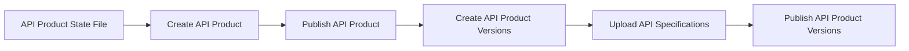

# Konnect Dev Portal Ops CLI <!-- omit in toc -->

A rather opinionated CLI tool for managing API products on **Konnect Developer Portals**.

The tool is designed to perform various operations, such as publishing, deprecating, unpublishing, or deleting API products and their versions based on state files.

Ensure that the required Konnect Developer Portals are set up before using this tool.

> **Note:** The CLI is still under active development. Some features may not be fully supported yet. Use it responsibly and report any issues you encounter.

## Table of Contents <!-- omit in toc -->
- [Features](#features)
- [Installation](#installation)
- [Usage](#usage)
  - [Available Commands](#available-commands)
    - [`sync`](#sync)
    - [`delete`](#delete)
    - [`explain`](#explain)
  - [Common Arguments](#common-arguments)
  - [Advanced examples](#advanced-examples)
    - [🚫 Unpublish API Product Versions](#-unpublish-api-product-versions)
    - [⚠️ Deprecate API Product Versions](#️-deprecate-api-product-versions)
    - [🔗 Link Gateway Services to API Product versions](#-link-gateway-services-to-api-product-versions)
    - [📚 Managing API Products Documentation](#-managing-api-products-documentation)
- [State file explanation](#state-file-explanation)
  - [Version](#version)
  - [Info](#info)
  - [Documents](#documents)
  - [Portals](#portals)
  - [Versions](#versions)
  - [Summary](#summary)
- [Logging](#logging)
- [Local Development](#local-development)
- [Testing](#testing)

## Features

- **Publish or update API Products and Versions** on a Konnect Dev Portal.  
- Link **Gateway Services** to **API Product Versions**.
- Manage **API Product Documents**.
- **Deprecate or unpublish API versions**.  
- **Delete API products** and their associations.  
- Supports **non-interactive modes** for automation.  

## Installation

1. Install the CLI using `pip`:

   ```shell
   $ pip install kptl
   ```

2. (Optional) Create a `yaml` config file to set the CLI configuration variables.  
   ```yaml
      # $HOME/.kptl.config.yaml
      konnect_url: https://us.api.konghq.com
      konnect_token: <your-konnect-token>
      http_proxy: http://proxy.example.com:8080 # Optional
      https_proxy: https://proxy.example.com:8080 # Optional
   ```

## Usage

```shell
$ kptl [command] [options]
```

### Available Commands

#### `sync`

Synchronize the predefined API Product state with Konnect Developer Portals using the `sync` command. 

This command uses API Product state files to determine the operations to perform on Konnect.

Example of a simple state file:

```yaml
# httpbin_state.yaml
_version: 1.0.0 # API Product Configuration file version
info:
   name: HTTPBin API # API Product name
   description: A simple API Product for requests to httpbin # API Product description
portals: # List of portals to publish the API Product to
   - name: dev_portal
   - name: prod_portal
versions: # List of API Product versions
   - name: "1.0.0" # API Product version name. Optional - defaults to the version in the OAS spec.
      spec: examples/api-specs/v1/httpbin.yaml # Path to the OAS spec file for the API Product version
      portals: # List of portals to publish the API Product version to
         - name: dev_portal   
         - name: prod_portal
   - name: "2.0.0"
      spec: examples/api-specs/v2/httpbin.yaml
      portals:
         - name: dev_portal
         - name: prod_portal
```

To sync the API Product state with Konnect, run:

```shell
$ kptl sync httpbin_state.yaml --config .config.yaml
```

This command will:
1. Ensure the API Product is created on Konnect.
2. Publish the API Product to the specified portals.
3. Create the API Product versions on Konnect.
4. Upload the defined API specifications to the respective API Product versions.
5. Publish the API Product versions to the specified portals.



#### `delete`

Delete the API Product and its associations from Konnect using the `delete` command.

```shell
$ kptl delete product_name_or_id --config .config.yaml
```

to skip the interactive confirmation prompt, use the `--yes` flag:

```shell
$ kptl delete product_name_or_id --config .config.yaml --yes
```

#### `explain`

Explain the API Product state file and the operations that will be performed on Konnect.

```shell
$ kptl explain httpbin_state.yaml
```

### Common Arguments

The CLI supports the following arguments:

| Option            | Required                         | Description                                                                |
| ----------------- | -------------------------------- | -------------------------------------------------------------------------- |
| `--konnect-token` | **Yes** (if config file not set) | The Konnect token to use for authentication.                               |
| `--konnect-url`   | **Yes** (if config file not set) | The Konnect API server URL.                                                |
| `--config`        | No                               | Path to the CLI configuration file. Defaults to `$HOME/.kptl.config.yaml`. |
| `--http-proxy`    | No                               | HTTP proxy URL.                                                            |
| `--https-proxy`   | No                               | HTTPS proxy URL.                                                           |

### Advanced examples

For a full state file example, see the [examples/products/httpbin/httpbin_state.yaml](examples/products/httpbin/httpbin_state.yaml) file.

#### 🚫 Unpublish API Product Versions

To unpublish an API Product version from a portal, update the state file to set the `publish_status` to `unpublished` for the desired portal.

```yaml
# httpbin_state.yaml
...
versions:
   - name: "1.0.0"
      spec: examples/api-specs/v1/httpbin.yaml
      portals:
         - name: dev_portal
            config:
               publish_status: unpublished
...
```

Then run the sync command:

```shell
$ kptl sync httpbin_state.yaml --config .config.yaml
```

#### ⚠️ Deprecate API Product Versions

To deprecate an API Product version from a portal, update the state file to set the `deprecated` to `true` for the desired portal.

```yaml
# httpbin_state.yaml
...
versions:
   - name: "1.0.0"
      spec: examples/api-specs/v1/httpbin.yaml
      portals:
         - name: dev_portal
            config:
               deprecated: true
...

```

Then run the sync command:

```shell
$ kptl sync httpbin_state.yaml --config .config.yaml
```

#### 🔗 Link Gateway Services to API Product versions

To link a Gateway Service to an API Product version, update the state file to include the `gateway_service` section with the appropriate `id` and `control_plane_id`.

```yaml
# httpbin_state.yaml
...
versions:
   - name: "1.0.0"
      spec: examples/api-specs/v1/httpbin.yaml
      gateway_service:
         id: <gateway-service-id>
         control_plane_id: <control-plane-id>
...
```

Then run the sync command:

```shell
$ kptl sync httpbin_state.yaml --config .config.yaml
```

#### 📚 Managing API Products Documentation

How it works:
- All related API Product documents must be present in a directory.
- All `.md` files in the directory are considered documentation files.
- The ordering and inheritance of documents are based on the file name prefixes (ex: `1_,1.1_,1.2_,2_,3_,3.1_`).
- By default, all documents get published. If you want to unpublish a document, add the `__unpublished` tag at the end of the file name.
- Existing API Product documents that are not present in the documents folder will be deleted.

For an example documents folder structure and use-cases, see the [examples/products/httbin/docs](examples/products/httbin/docs) directory.

To sync the API Product documents, update the state file to include the `documents` section with the `sync` flag set to `true` and the `dir` pointing to the documents directory.

```yaml
# httpbin_state.yaml
...
info: ...
documents:
   sync: true
   dir: examples/products/httpbin/docs
...
```

Then run the sync command:

```shell
$ kptl sync httpbin_state.yaml --config .config.yaml
```

## State file explanation


This `state.yaml` file defines the configuration for the HTTPBin API product. Below is a breakdown of its structure and key components:

### Version
```yaml
_version: 1.0.0
```
Specifies the version of the state file format.

### Info
```yaml
info:
  name: HTTPBin API
  description: A simple API Product for requests to /httpbin
```
Contains metadata about the API product, including its name and description.

### Documents
```yaml
documents:
  sync: true
  dir: examples/products/httpbin/docs
```
Defines the synchronization settings and directory for the API documentation.

### Portals
```yaml
portals:
  - name: dev_portal
    config:
      publish_status: published
  - name: prod_portal
    config:
      publish_status: unpublished
```
Lists the portals where the API product will be published, along with their publication status.

### Versions
```yaml
versions:
  - name: "1.0.0"
    spec: examples/api-specs/v1/httpbin.yaml
    gateway_service:
      id: null
      control_plane_id: null
    portals:
      - name: dev_portal
        config:
          deprecated: true
          publish_status: published
          auth_strategy_ids: []
          application_registration:
            enabled: false
            auto_approve: false
      - name: prod_portal
        config:
          deprecated: true
          publish_status: published
          auth_strategy_ids: []
          application_registration:
            enabled: false
            auto_approve: false
  - name: "2.0.0"
    spec: examples/api-specs/v2/httpbin.yaml
    gateway_service:
      id: null
      control_plane_id: null
    portals:
      - name: dev_portal
        config:
          deprecated: false
          publish_status: published
          auth_strategy_ids: []
          application_registration:
            enabled: false
            auto_approve: false
      - name: prod_portal
        config:
          deprecated: false
          publish_status: published
          auth_strategy_ids: []
          application_registration:
            enabled: false
            auto_approve: false
```
Defines the different versions of the API product, including their specifications, gateway service details, and portal configurations. Each version can have different settings for deprecation, publication status, authentication strategies, and application registration.

### Summary
- **Version**: Specifies the format version of the state file.
- **Info**: Contains metadata about the API product.
- **Documents**: Defines documentation synchronization settings.
- **Portals**: Lists the portals and their publication statuses.
- **Versions**: Details the different versions of the API product and their configurations.

This file is essential for managing the lifecycle and publication of the HTTPBin API product across different environments and versions.

## Logging

The CLI uses the `logging` module to log messages to the console. The default log level is set to `INFO`.

To change the log level, set the `LOG_LEVEL` environment variable to one of the following values: `DEBUG`, `INFO`, `WARNING`, or `ERROR`.

## Local Development

***Requirements***

- Python 3+  
- `PyYaml`: For parsing YAML-based files.  
- `requests`: For making HTTP requests to the Konnect API.

1. Clone the repository:  
   ```shell
      $ git clone https://github.com/pantsel/konnect-portal-ops-cli
   ```

2. Install the dependencies:  
   ```shell
      $ make deps
   ```

3. Run the CLI directly:  
   ```shell
      $ PYTHONPATH=src python src/kptl/main.py [command] [options]
   ```

## Testing

To run the tests, use the following command from the root directory:  

```shell
$ make test
```