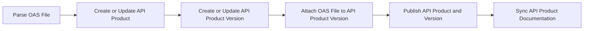

# Konnect Dev Portal Ops CLI

A rather opinionated CLI tool for managing API products on **Konnect Developer Portals**.

The tool is designed to perform various operations, such as publishing, deprecating, unpublishing, or deleting API products and their versions based on OpenAPI Specification (OAS) files.

> The CLI is still under active development. Some features may not be fully supported yet. Use it responsibly and report any issues you encounter.

## Prerequisites

Ensure that the Konnect Developer Portals are set up and pre-configured before using this tool.

## Features

- **Publish or update API products** on a Konnect Dev Portal.  
- **Deprecate or unpublish API versions**.  
- **Delete API products** and their associations.  
- Manage **API product documentation**.
- Supports **non-interactive modes** for automation.  

## Requirements

- Python 3+  
- Dependencies listed in [requirements.txt](#dependencies).  

## How It Works

The CLI tool requires two primary inputs:
- The path to an OpenAPI Specification (OAS) file.
- The name of the Konnect portal to perform operations on.

It then parses the OAS file to extract essential information for identifying the API Product and its version:

- The `info.title` field in the OAS file serves as the API Product name, acting as the primary identifier for idempotent operations.
- The `info.description` field in the OAS file provides the API Product description.
- The `info.version` field in the OAS file denotes the API Product Version name, which is the primary identifier for version-specific idempotent operations.

Finally, the tool executes the following operations:
1. Creates or updates the API Product on the Portal.
2. Creates or updates the associated API Product Version.
3. Attaches the OAS file to the API Product Version.
4. Publishes the API Product and its Version on the Portal.
5. If a documents folder is provided, the tool synchronizes its contents with the API Product documentation on the Portal. This includes publishing new documents, updating existing ones, and removing documents that are no longer present in the folder.

Flow:



## Installation

1. Clone this repository:  
   ```shell
      $ git clone https://github.com/pantsel/konnect-portal-ops-examples
      $ cd konnect-portal-ops-examples/src
   ```

2. Install dependencies:  
   ```shell
      $ pip install -r requirements.txt
   ```

3. (Optional) Create a `yaml` config file to set the configuration variables.  
   ```yaml
      # .config.yaml
      konnect_url: https://us.api.konghq.com
      konnect_token: <your-konnect-token>
   ```

## Usage

Run the script using the following command:  

```shell
$ python main.py [options]  
```

### Arguments

| Option                               | Required                                                | Description                                                          |
| ------------------------------------ | ------------------------------------------------------- | -------------------------------------------------------------------- |
| `--oas-spec`                         | **Yes**                                                 | Path to the OAS spec file.                                           |
| `--docs`                             | No                                                      | Path to the API product documents folder.                            |
| `--konnect-portal-name`              | **Yes** (except for `--delete`)                         | Name of the Konnect portal to perform operations on.                 |
| `--konnect-token`                    | **Yes** (except for `--config`)                         | The Konnect spat or kpat token.                                      |
| `--konnect-url`                      | **Yes** (except for `--config`)                         | The Konnect API server URL.                                          |
| `--deprecate`                        | No                                                      | Deprecate the API product version on the portal.                     |
| `--application-registration-enabled` | No                                                      | Enable application registration for the API product on the portal.   |
| `--auto-aprove-registration`         | No                                                      | Automatically approve application registrations for the API product. |
| `--auth-strategy-ids`                | No                                                      | Comma-separated list of authentication strategy IDs.                 |
| `--unpublish {product,version}`      | No                                                      | Unpublish the API product or version from the portal.                |
| `--delete`                           | No                                                      | Delete the API product and it's associations.                        |
| `--yes`                              | No                                                      | Skip confirmation prompts (useful for non-interactive environments). |
| `--config`                           | **Yes** (except for `--konnect-token`, `--konnect-url`) | Path to the configuration file.                                      |

### Examples

#### Publish an API Product and version to a Portal

```bash
$ python main.py --config .config.yaml \
   --oas-spec ../examples/oasv1.yaml \
   --konnect-portal-name my-portal 
```
#### Publish a new version of the API Product to a Portal

```bash
$ python main.py --config .config.yaml \
   --oas-spec ../examples/oasv2.yaml \
   --konnect-portal-name my-portal
```

#### Deprecate an API Version on a Portal

```bash
$ python main.py --config .config.yaml \
   --oas-spec ../examples/oasv1.yaml \
   --konnect-portal-name my-portal --deprecate
```

#### Unpublish an API Version from a Portal

```bash
$ python main.py --config .config.yaml \
   --oas-spec ../examples/oasv1.yaml \
   --konnect-portal-name my-portal \
   --unpublish version
```

#### Unpublish an API Product from a Portal

```bash
$ python main.py --config .config.yaml \
   --oas-spec ../examples/oasv1.yaml \
   --konnect-portal-name my-portal \
   --unpublish product
```

#### Managing API Products documentation

How it works:
- All related API Product documents must be present in a directory.
- All `.md` files in the directory are considered documentation files.
- The ordering and inheritance of documents are based on the file names.
- By default, all documents get published. If you want to unpublish a document, add the `__unpublished` tag at the end of the file name.
- Existing API Product documents that are not present in the documents folder will be deleted.

For an example documents folder structure and use-cases, see the [examples/docs](examples/docs) directory.

```bash
$ python main.py --config .config.yaml \
   --oas-spec ../examples/oasv1.yaml \
   --docs ../examples/docs \
   --konnect-portal-name my-portal
```

#### Completely delete an API Product and its associations

```bash
$ python main.py --config .config.yaml \
   --oas-spec ../examples/oasv1.yaml --delete --yes
```

## CLI Configuration

The CLI supports the following variables for configuration in a `yaml` file:  

| Variable        | Description                            |
| --------------- | -------------------------------------- |
| `konnect_url`   | Konnect API server URL.                |
| `konnect_token` | Token for authenticating API requests. |

And the following environment variables:

| Variable    | Description                                                                     |
| ----------- | ------------------------------------------------------------------------------- |
| `LOG_LEVEL` | Logging verbosity level (`DEBUG`, `INFO`, `WARNING`, `ERROR`). Default: `INFO`. |


## Logging

Logs are output to the console, and the verbosity is controlled by the `LOG_LEVEL` environment variable. Available levels are:  

- `DEBUG`: Detailed information for troubleshooting.  
- `INFO`: General operational messages (default).  
- `WARNING`: Non-critical issues.  
- `ERROR`: Critical errors that prevent execution.  

## Dependencies

The script requires the following Python libraries:  

- `PyYaml`: For parsing YAML-based files.  
- `requests`: For making HTTP requests to the Konnect API.

Install all dependencies using: `pip install -r requirements.txt` 

## Error Handling

The script includes robust error handling and will:  

- Log errors with a descriptive message.  
- Exit with a non-zero status code in case of failures.  

## Testing

To run the tests, use the following command from the root directory:  

```shell
$ PYTHONPATH=src pytest tests/ -vv
```