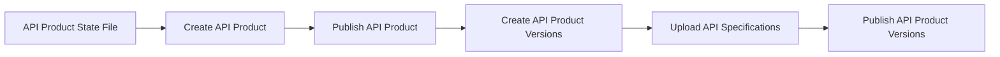

# Konnect Dev Portal Ops CLI <!-- omit in toc -->

A rather opinionated CLI tool for managing API products on **Konnect Developer Portals**.

The tool is designed to perform various operations, such as publishing, deprecating, unpublishing, or deleting API products and their versions based on OpenAPI Specification (OAS) files.

Ensure that the required Konnect Developer Portals are set up before using this tool.

> **Note:** The CLI is still under active development. Some features may not be fully supported yet. Use it responsibly and report any issues you encounter.

## Table of Contents <!-- omit in toc -->
- [Features](#features)
- [Installation](#installation)
- [Usage](#usage)
  - [Available Commands](#available-commands)
    - [`sync`](#sync)
    - [`delete`](#delete)
  - [Common Arguments](#common-arguments)
  - [Examples](#examples)
    - [🚀 Publish an API Product and Version to a Portal](#-publish-an-api-product-and-version-to-a-portal)
    - [🔗 Link a Gateway Service to an API Product Version](#-link-a-gateway-service-to-an-api-product-version)
    - [🚀 Publish a New Version of the API Product to a Portal](#-publish-a-new-version-of-the-api-product-to-a-portal)
    - [⚠️ Deprecate an API Version on a Portal](#️-deprecate-an-api-version-on-a-portal)
    - [🚫 Unpublish an API Version from a Portal](#-unpublish-an-api-version-from-a-portal)
    - [🚫 Unpublish an API Product from a Portal](#-unpublish-an-api-product-from-a-portal)
    - [📚 Managing API Products Documentation](#-managing-api-products-documentation)
    - [🗑️ Completely Delete an API Product and Its Associations](#️-completely-delete-an-api-product-and-its-associations)
- [CLI Configuration](#cli-configuration)
- [Local Development](#local-development)
- [Testing](#testing)

## Features

- **Publish or update API Products and Versions** on a Konnect Dev Portal.  
- Link **Gateway Services** to **API Product Versions**.
- Manage **API Product Documents**.
- **Deprecate or unpublish API versions**.  
- **Delete API products** and their associations.  
- Supports **non-interactive modes** for automation.  

## Installation

1. Install the CLI using `pip`:

   ```shell
   $ pip install kptl
   ```

2. (Optional) Create a `yaml` config file to set the CLI configuration variables.  
   ```yaml
      # $HOME/.kptl.config.yaml
      konnect_url: https://us.api.konghq.com
      konnect_token: <your-konnect-token>
      http_proxy: http://proxy.example.com:8080 # Optional
      https_proxy: https://proxy.example.com:8080 # Optional
   ```

## Usage

```shell
$ kptl [command] [options]
```

### Available Commands

#### `sync`

Synchronize the predefined API Product state with Konnect Developer Portals using the `sync` command. 

This command uses API Product state files to determine the operations to perform on Konnect.

Example of a simple state file:

```yaml
# httpbin_state.yaml
_version: 1.0.0 # API Product Configuration file version
info:
   name: HTTPBin API # API Product name
   description: A simple API Product for requests to httpbin # API Product description
portals: # List of portals to publish the API Product to
   - name: dev_portal
   - name: prod_portal
versions: # List of API Product versions
   - name: "1.0.0" # API Product version name. Optional - defaults to the version in the OAS spec.
      spec: examples/api-specs/v1/httpbin.yaml # Path to the OAS spec file for the API Product version
      portals: # List of portals to publish the API Product version to
         - name: dev_portal   
         - name: prod_portal
   - name: "2.0.0"
      spec: examples/api-specs/v2/httpbin.yaml
      portals:
         - name: dev_portal
         - name: prod_portal
```

To sync the API Product state with Konnect, run:

```shell
$ kptl sync httpbin_state.yaml --config .config.yaml
```

This command will:
1. Ensure the API Product is created on Konnect.
2. Publish the API Product to the specified portals.
3. Create the API Product versions on Konnect.
4. Upload the defined API specifications to the respective API Product versions.
5. Publish the API Product versions to the specified portals.



#### `delete`

Delete the API Product and its associations from Konnect using the `delete` command.

```shell
$ kptl delete product_name_or_id --config .config.yaml
```

to skip the interactive confirmation prompt, use the `--yes` flag:

```shell
$ kptl delete product_name_or_id --config .config.yaml --yes
```

### Common Arguments

The CLI supports the following arguments:

| Option            | Required                         | Description                                                                |
| ----------------- | -------------------------------- | -------------------------------------------------------------------------- |
| `--konnect-token` | **Yes** (if config file not set) | The Konnect token to use for authentication.                               |
| `--konnect-url`   | **Yes** (if config file not set) | The Konnect API server URL.                                                |
| `--config`        | No                               | Path to the CLI configuration file. Defaults to `$HOME/.kptl.config.yaml`. |
| `--http-proxy`    | No                               | HTTP proxy URL.                                                            |
| `--https-proxy`   | No                               | HTTPS proxy URL.                                                           |

### Examples

#### 🚀 Publish an API Product and Version to a Portal

```bash
$ kptl --config .config.yaml \
   --oas-spec ../examples/api-specs/v1/httpbin.yaml \
   --konnect-portal-name my-portal 
```

#### 🔗 Link a Gateway Service to an API Product Version

```bash
$ kptl --config .config.yaml \
   --oas-spec ../examples/api-specs/v1/httpbin.yaml \
   --konnect-portal-name my-portal \
   --gateway-service-id <gateway-service-id>
   --gateway-service-control-plane-id <gateway-service-control-plane-id>
```

#### 🚀 Publish a New Version of the API Product to a Portal

```bash
$ kptl --config .config.yaml \
   --oas-spec ../examples/api-specs/v2/httpbin.yaml \
   --konnect-portal-name my-portal
```

#### ⚠️ Deprecate an API Version on a Portal

```bash
$ kptl --config .config.yaml \
   --oas-spec ../examples/api-specs/v1/httpbin.yaml \
   --konnect-portal-name my-portal --deprecate
```

#### 🚫 Unpublish an API Version from a Portal

```bash
$ kptl --config .config.yaml \
   --oas-spec ../examples/api-specs/v1/httpbin.yaml \
   --konnect-portal-name my-portal \
   --unpublish version
```

#### 🚫 Unpublish an API Product from a Portal

```bash
$ kptl --config .config.yaml \
   --oas-spec ../examples/api-specs/v1/httpbin.yaml \
   --konnect-portal-name my-portal \
   --unpublish product
```

#### 📚 Managing API Products Documentation

How it works:
- All related API Product documents must be present in a directory.
- All `.md` files in the directory are considered documentation files.
- The ordering and inheritance of documents are based on the file name prefixes (ex: `1_,1.1_,1.2_,2_,3_,3.1_`).
- By default, all documents get published. If you want to unpublish a document, add the `__unpublished` tag at the end of the file name.
- Existing API Product documents that are not present in the documents folder will be deleted.

For an example documents folder structure and use-cases, see the [examples/docs](examples/docs) directory.

```bash
$ kptl --config .config.yaml \
   --oas-spec ../examples/api-specs/v1/httpbin.yaml \
   --docs ../examples/docs/httpbin \
   --konnect-portal-name my-portal
```

#### 🗑️ Completely Delete an API Product and Its Associations

```bash
$ kptl --config .config.yaml \
   --oas-spec ../examples/api-specs/v1/httpbin.yaml --delete --yes
```

## CLI Configuration

The CLI supports the following variables for configuration in a `yaml` file:  

| Variable        | Description                            |
| --------------- | -------------------------------------- |
| `konnect_url`   | Konnect API server URL.                |
| `konnect_token` | Token for authenticating API requests. |

And the following environment variables:

| Variable    | Description                                                                     |
| ----------- | ------------------------------------------------------------------------------- |
| `LOG_LEVEL` | Logging verbosity level (`DEBUG`, `INFO`, `WARNING`, `ERROR`). Default: `INFO`. |

## Local Development

***Requirements***

- Python 3+  
- `PyYaml`: For parsing YAML-based files.  
- `requests`: For making HTTP requests to the Konnect API.

1. Clone the repository:  
   ```shell
      $ git clone https://github.com/pantsel/konnect-portal-ops-cli
   ```

2. Install the dependencies:  
   ```shell
      $ make deps
   ```

3. Run the CLI directly:  
   ```shell
      $ PYTHONPATH=src python src/kptl/main.py [options]
   ```

## Testing

To run the tests, use the following command from the root directory:  

```shell
$ make test
```