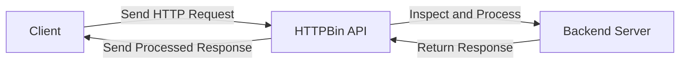

# HTTPBin API Technical Documentation

The HTTPBin API is a versatile tool designed for developers and integrators to test and debug HTTP requests. It allows users to inspect various aspects of HTTP requests, such as headers, query parameters, and payloads. Whether you're building an API client, testing endpoint integrations, or learning about HTTP protocols, HTTPBin provides a straightforward and reliable interface.

### Key Features

1. **Request Inspection**: Examine the details of any HTTP request, including headers, query parameters, and payloads.
2. **Flexible Endpoints**: Supports multiple HTTP methods, such as GET, POST, PUT, and DELETE, to test different scenarios.
3. **Authentication Support**: Offers Basic Authentication and OpenID Connect for secure access.
4. **Custom Headers**: Add and inspect custom headers to simulate real-world use cases.
5. **Error Simulation**: Test how your application handles various HTTP status codes and error conditions.

### Use Cases

- **API Development**: Quickly debug and test API requests during development.
- **Learning and Prototyping**: Understand HTTP concepts and prototype integrations without a complex setup.
- **Performance Testing**: Measure response times and behavior under different request loads.

### Architecture Overview

### Supported Environments

The HTTPBin API is compatible with:
- REST clients like Insomnia
- Curl and other command-line HTTP tools
- Custom-built applications in any programming language

### API Philosophy

The HTTPBin API aims to simplify the debugging and testing process for developers. It emphasizes clarity, reliability, and ease of use, making it an indispensable tool in any developer's toolkit.