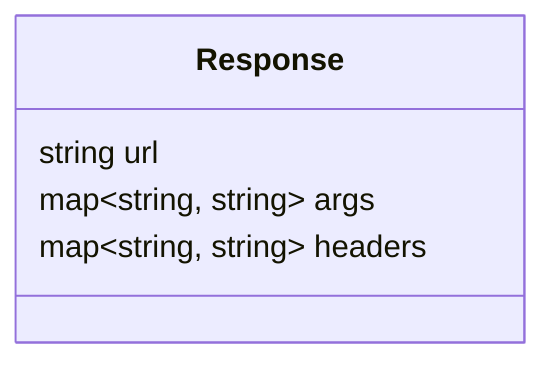
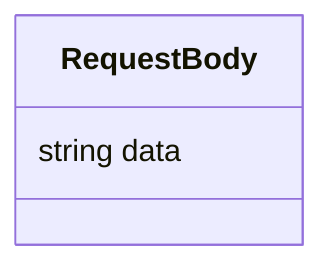

# 2. Endpoints

## 2.1 GET /httpbin

**Purpose:** Retrieve request data sent to the HTTPBin endpoint.

**Response Structure:**


### Example Request:
```http
GET /httpbin HTTP/1.1
Host: example.com
Authorization: Bearer <token>
```

### Example Response:
```json
{
  "url": "https://example.com/httpbin",
  "args": {
    "param1": "value1"
  },
  "headers": {
    "Content-Type": "application/json"
  }
}
```

---

## 2.2 POST /httpbin

**Purpose:** Submit data to the HTTPBin endpoint.

### Request Body:


### Example Request:
```http
POST /httpbin HTTP/1.1
Host: example.com
Content-Type: application/json
Authorization: Bearer <token>

{
  "data": "example payload"
}
```

### Example Response:
```json
{
  "url": "https://example.com/httpbin",
  "args": {},
  "headers": {
    "Content-Type": "application/json"
  },
  "json": {
    "data": "example payload"
  }
}
```

**Flow for POST Requests:**

