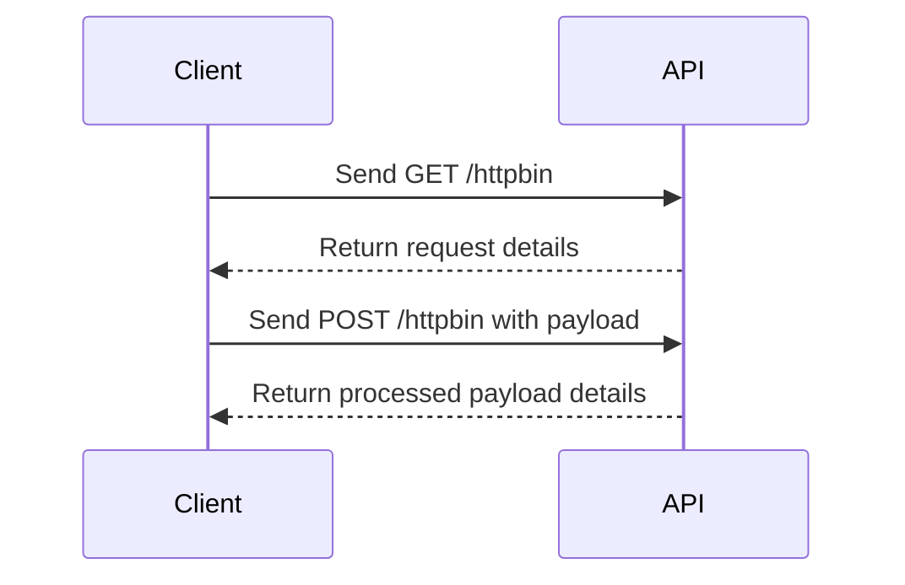

# 4. Diagrams and Use Cases

### Sequence Diagram

```mermaid
sequenceDiagram
    participant Client
    participant API
    Client->>API: Send GET /httpbin
    API-->>Client: Return request details
    Client->>API: Send POST /httpbin with payload
    API-->>Client: Return processed payload details
```