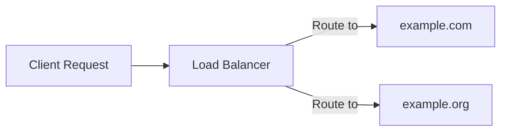

# 5. Advanced Features

- **Custom Headers:** Include headers like `ngrok-skip-browser-warning` to bypass specific checks.
- **Multi-Server Support:** Switch between `https://example.com` and `https://example.org` seamlessly.

### Load Balancing (Future Implementation)

