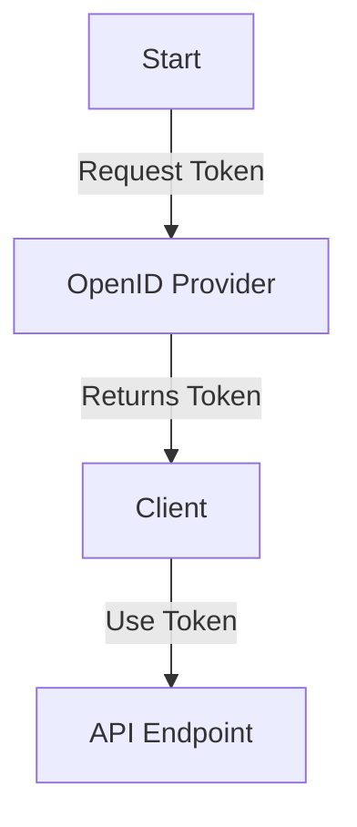

# 1. Authentication

The HTTPBin API supports two authentication mechanisms:

### Basic Authentication
- A username and password must be provided in the request.

### OpenID Connect
- Use an OpenID provider to obtain a token. The OpenID configuration can be found at:
  [OpenID Configuration](https://myidp.com/.well-known/openid-configuration)

**Authentication Flow:**
