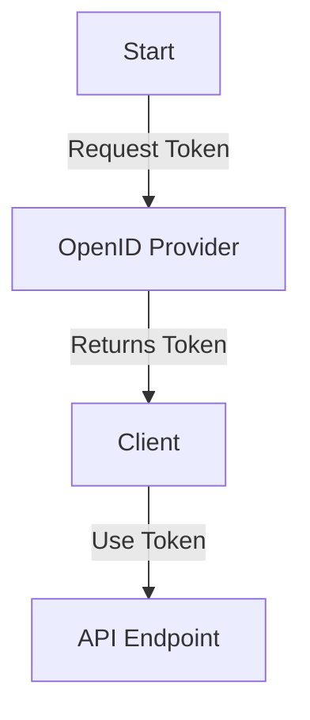
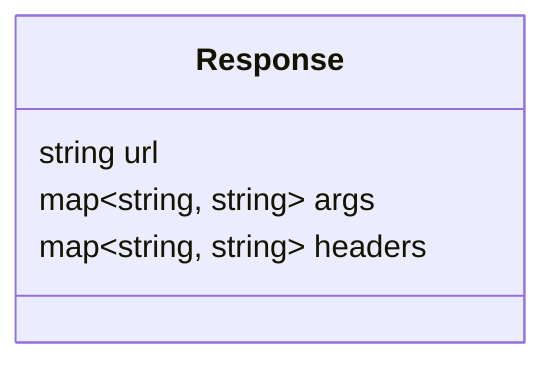
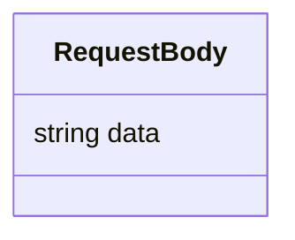
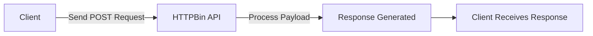
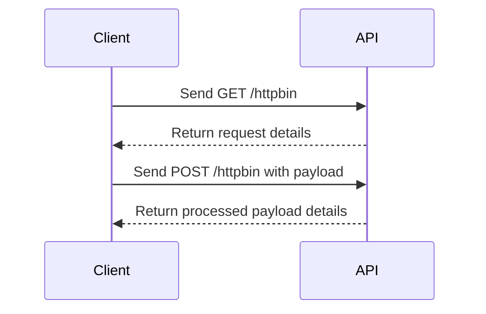
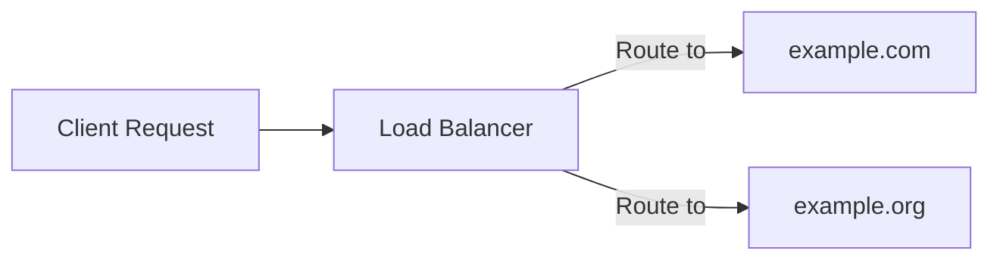

# HTTPBin API Technical Documentation

## Introduction

The HTTPBin API offers a powerful and straightforward way to inspect request and response details. This technical documentation provides in-depth guidance on interacting with the API, suitable for developers and integrators.

---

# 1. Authentication

The HTTPBin API supports two authentication mechanisms:

### Basic Authentication
- A username and password must be provided in the request.

### OpenID Connect
- Use an OpenID provider to obtain a token. The OpenID configuration can be found at:
  [OpenID Configuration](https://myidp.com/.well-known/openid-configuration)

**Authentication Flow:**


---

# 2. Endpoints

## 2.1 GET /httpbin

**Purpose:** Retrieve request data sent to the HTTPBin endpoint.

**Response Structure:**


### Example Request:
```http
GET /httpbin HTTP/1.1
Host: example.com
Authorization: Bearer <token>
```

### Example Response:
```json
{
  "url": "https://example.com/httpbin",
  "args": {
    "param1": "value1"
  },
  "headers": {
    "Content-Type": "application/json"
  }
}
```

---

## 2.2 POST /httpbin

**Purpose:** Submit data to the HTTPBin endpoint.

### Request Body:


### Example Request:
```http
POST /httpbin HTTP/1.1
Host: example.com
Content-Type: application/json
Authorization: Bearer <token>

{
  "data": "example payload"
}
```

### Example Response:
```json
{
  "url": "https://example.com/httpbin",
  "args": {},
  "headers": {
    "Content-Type": "application/json"
  },
  "json": {
    "data": "example payload"
  }
}
```

**Flow for POST Requests:**


---

# 3. Error Handling

The API provides detailed error responses for invalid requests. Below is a summary of potential errors:

| HTTP Status Code | Description             |
|------------------|-------------------------|
| 400              | Bad Request             |
| 401              | Unauthorized            |
| 403              | Forbidden               |
| 500              | Internal Server Error   |

**Example Error Response:**
```json
{
  "error": "Bad Request",
  "message": "Invalid query parameters."
}
```

---

# 4. Diagrams and Use Cases

### Sequence Diagram


---

# 5. Advanced Features

- **Custom Headers:** Include headers like `ngrok-skip-browser-warning` to bypass specific checks.
- **Multi-Server Support:** Switch between `https://example.com` and `https://example.org` seamlessly.

### Load Balancing (Future Implementation)


---

# 6. FAQ

**Q: Can I use both Basic Auth and OpenID in the same request?**  
**A:** No, only one authentication method should be used per request.

**Q: Are there rate limits?**  
**A:** Yes, consult the API provider for specific rate-limiting policies.

---

# 7. Appendix

## OpenAPI Specification
Refer to the OpenAPI document for a complete schema definition.

## Related Links
- [OpenID Documentation](https://openid.net/)
- [HTTPBin Examples](https://httpbin.org/)
