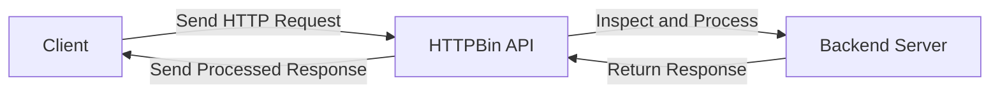

### Architecture Overview

```mermaid
graph LR
    Client -->|Send HTTP Request| HTTPBin[HTTPBin API]
    HTTPBin -->|Inspect and Process| Server[Backend Server]
    Server -->|Return Response| HTTPBin
    HTTPBin -->|Send Processed Response| Client
```